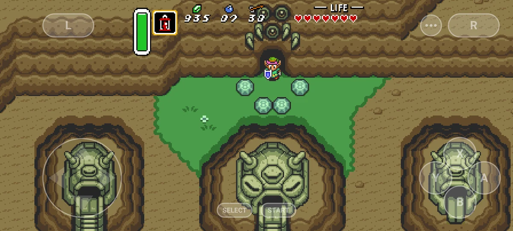
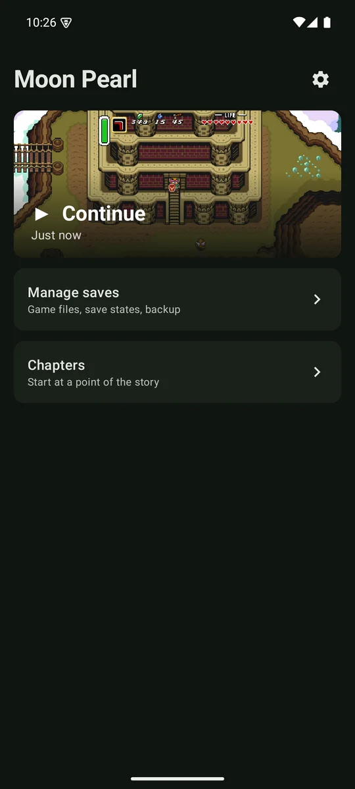
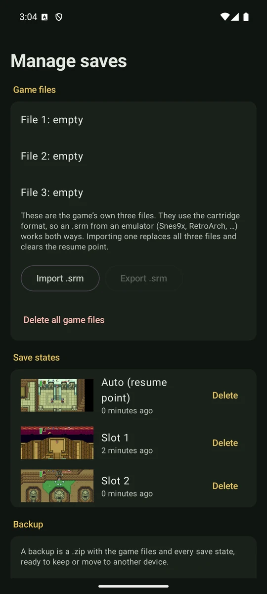
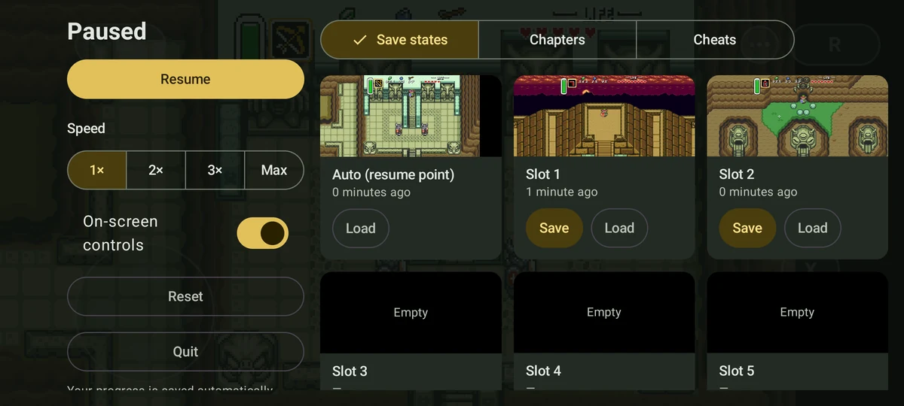
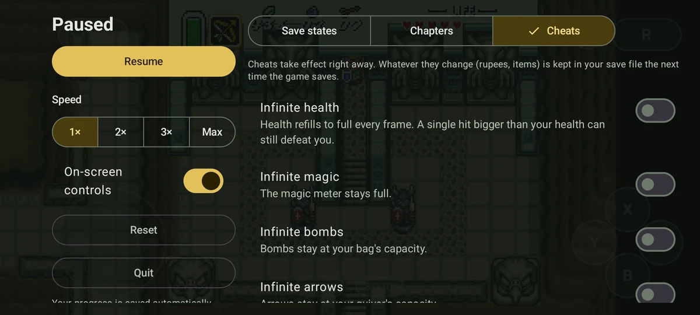

# Moon Pearl

A native Android port of [zelda3](https://github.com/snesrev/zelda3), the complete C
reimplementation of ALttP, with widescreen, save states, rewind, fast-forward, image filters,
cheats and controller support. Bring your own ROM; the app sets everything up on the device.

<p align="center">
  
</p>

<p align="center">
  
  
</p>

<p align="center">
  
  
</p>

## Features

- **Set up in seconds.** Pick your ROM with the system file picker (`.sfc` or `.smc`, zipped
  or not). The app checks it and builds the game data on the device. No PC, no scripts, no
  copying files around. The ROM itself is not kept.
- **Widescreen** up to 18:9, and a *fill the screen* mode that covers the whole display.
- **In-game menu**: 9 save state slots with screenshots, jump to the start of any chapter,
  fast-forward at 2×, 3× or maximum speed, reset. The game is paused while it is open.
- **Resume where you left off.** Progress is saved whenever the app goes to the background,
  so nothing is lost if Android closes it.
- **Touch controls** with multi-touch, an 8-way d-pad, sliding between buttons, haptic
  feedback and adjustable opacity. Every button can be moved and resized, and an optional
  hold-to-fast-forward button can be added.
- **Controllers** (Xbox, PlayStation, Switch Pro and most others) are detected
  automatically; the touch controls hide while one is in use. The original buttons can be remapped
  to any controller button.
- **Link's look**: replace Link with any of the hundreds of community sprites (`.zspr` files
  from the [sprite gallery](https://snesrev.github.io/sprites-gfx/snes/zelda3/link/)), with a
  preview of each.
- **MSU-1 soundtracks**: play the game with a replacement soundtrack pack (orchestral,
  CD-quality and others, in PCM or OPUZ, including MSU Deluxe). Pick the pack's folder; the
  files are read in place, not copied.
- **Widescreen HUD** (optional): the magic meter, item and counters move to the left edge and the
  hearts to the right, as in a game made for wide screens.
- **Image filters**: sharp or smooth pixels, CRT scanlines, an LCD grid and pixel art
  smoothing (xBR, OmniScale), or your own RetroArch GLSL shaders. Switch them from the in-game
  menu and see the result right away.
- **Rewind**: hold LT+RT on a controller (or use the touch
  button or the in-game menu) and watch the last minute of play go back, then continue from any
  point. Loading a save state or a chapter starts the history over.
- **Cheats**: infinite health, magic, bombs, arrows and small keys, a full wallet, walking
  through walls, and Pro Action Replay codes.
- **Save management**: see your three game files, erase them, export or restore a backup,
  and move saves to and from emulators as `.srm` files.
- **Enhancements** from the zelda3 project (switch items with L/R, turn while dashing, bug
  fixes and more), each explained in the app. All off by default.
- English and Brazilian Portuguese.

## Installing

1. Download the latest `moonpearl-x.y.z.apk` from
   [Releases](https://github.com/DoutorRaposo/moonpearl/releases) and open it on your
   device. Android asks you to allow installing apps from your browser or file manager the
   first time.
2. Open **Moon Pearl**, tap **Select ROM** and pick your copy of the game.
3. Tap **Play**.

Updates install over the previous version and keep your data. To get them automatically,
add this repository to [Obtainium](https://github.com/ImranR98/Obtainium).

**Requirements:** Android 8.0 or newer on a 64-bit device (practically every phone from 2017
on).

### The ROM

You need the **US release** of *The Legend of Zelda: A Link to the Past*, dumped from a
cartridge you own:

| | |
|---|---|
| Size | 1 MiB (1,048,576 bytes); a 512-byte copier header is removed automatically |
| CRC32 | `777AAC2F` |

Other regions and translations are not supported: the app tells you if the file is not the
expected one. A ready-made `zelda3_assets.dat` from the PC version also works.

## Controls

| On screen | Controller | What it does |
|---|---|---|
| D-pad, L, R | D-pad, LB, RB | As on the original |
| A, B, X, Y | Face buttons by position, as on the original: right, bottom, top, left (B, A, Y, X on an Xbox pad) | As on the original |
| Start, Select | Start, Back/View | As on the original |
| ⋯ button (or double tap, if enabled) | Guide button or R3 | Open the menu |
| Rewind button (optional) | LT+RT | Rewind |
| Fast-forward button (optional, hold) | L3 | Fast-forward: hold at the speed you choose (2×, 3× or max); L3 cycles the speed, or holds if you prefer |
| Back button | | Open the menu |

In the menu, use the d-pad and A with a controller; B or the guide button closes it. The original
buttons can be remapped to any controller button (*Settings → Controls*), and the on-screen
buttons moved and resized (*Customize layout*).

## Questions

**The game resumed somewhere I did not expect.** With *Resume where you left off* on
(default), the game reopens exactly where you were, not at the file select screen. Use
*Reset* in the menu to go back to the title screen, or turn the option off in *Settings → Game*.

**Can I use my saves from an emulator?** Yes. In *Manage saves*, *Import .srm* takes the
save file from Snes9x, RetroArch and similar emulators, and *Export .srm* goes the other way.
Save states are specific to this app.

**Why do Game Genie codes not work?** They change the game's program code, which this
reimplementation does not run. Pro Action Replay codes that change RAM (`7Exxxx:yy`) work.

**The picture is cut at the top and bottom.** That is *Fill the screen* on a phone wider
than 2:1. Turn it off in *Settings → Display* to see the whole picture with bars at the sides.

**My MSU-1 pack is not found.** Pick the folder that holds the tracks themselves
(`name-1.pcm`, `name-2.pcm`… or `.opuz`), in *Settings → Audio*. Packs made for the US version
of the game work; MSU Deluxe tracks (37 and up) are used when *MSU Deluxe* is on.

**The game slows down or the screen goes black with a filter.** Shaders run on the GPU and
some are heavy for a phone. Pick a lighter one in the menu's *Image* tab or in *Settings →
Display → Image filter*. If a shader freezes the game, the app switches it off on its own and
tells you which one.

**Something went wrong.** If the game closes on an error, the home screen shows the message.
Please [open an issue](https://github.com/DoutorRaposo/moonpearl/issues/new/choose) with it,
your device, Android version and controller.

## Building

```sh
git clone --recursive https://github.com/DoutorRaposo/moonpearl
cd moonpearl
./gradlew assembleDebug
```

You need JDK 17+ and the Android SDK; Gradle installs the NDK and CMake versions it needs.
The APK ends up in `app/build/outputs/apk/debug/`. Debug builds install next to release
builds, as *Moon Pearl debug*.

### Release builds

Release APKs are signed with the key named in `keystore.properties` at the repository root
(not tracked by git):

```properties
storeFile=/path/to/release.jks
storePassword=...
keyAlias=...
keyPassword=...
```

CI reads the same values from the `MOONPEARL_KEYSTORE*` / `MOONPEARL_KEY*` environment
variables. Pushing a tag such as `v0.5.0` runs `.github/workflows/release.yml`, which builds
the signed APK (version taken from the tag) and publishes a GitHub release. It needs the
repository secrets `MOONPEARL_KEYSTORE_BASE64`, `MOONPEARL_KEYSTORE_PASSWORD`,
`MOONPEARL_KEY_ALIAS` and `MOONPEARL_KEY_PASSWORD`.

## How it fits together

zelda3 is pinned as a git submodule and left untouched. The few changes the game code needs
are small patches in `patches/zelda3`, applied to a copy at build time (see
[patches/README.md](patches/README.md)).

| Piece | Where |
|---|---|
| Game code | `external/zelda3` (submodule) plus `patches/zelda3` |
| SDL 2.32 (native and Java) | `external/SDL` (submodule) |
| Native entry point: runs the game from the app's data folder, logs to logcat, reports fatal errors | `app/src/main/cpp/android_main.c` |
| Cheats, applied before every frame | `app/src/main/cpp/cheats.c` |
| ROM import: applies upstream's `zelda3_assets.bps` to the ROM | `GameData.kt`, `Bps.kt` |
| Home screen; settings (stored in the stock `zelda3.ini`) | `LauncherActivity.kt`, `SettingsActivity.kt` |
| Game host, in its own `:game` process since upstream keeps its state in C globals | `GameActivity.kt` |
| In-game menu; drives upstream's own pause, save state and turbo shortcuts | `GameMenuActivity.kt` |
| Save files and backups | `SaveManager.kt`, `Sram.kt`, `SavesActivity.kt` |
| On-screen controls and their layout editor | `TouchControlsView.kt`, `TouchLayout.kt`, `TouchLayoutActivity.kt` |

Upstream binds Select to Right Shift. A held modifier turns other keys into Shift+key, which
would leave buttons stuck under multi-touch, so the app maps every pad button to a plain key
in `[KeyMap] Controls`.

## Credits

- [snesrev](https://github.com/snesrev) and the contributors of
  [zelda3](https://github.com/snesrev/zelda3), whose reimplementation this app runs.
- [SDL](https://www.libsdl.org), Opus and stb; see
  [THIRD_PARTY_NOTICES.txt](THIRD_PARTY_NOTICES.txt), also shown in the app.

## Legal

This project contains no game data. You must supply a ROM dumped from a cartridge you own.
It is an independent fan project, not affiliated with or endorsed by the owners of the game.
All trademarks belong to their respective owners.

The Android code in this repository is MIT licensed (see [LICENSE](LICENSE)).
